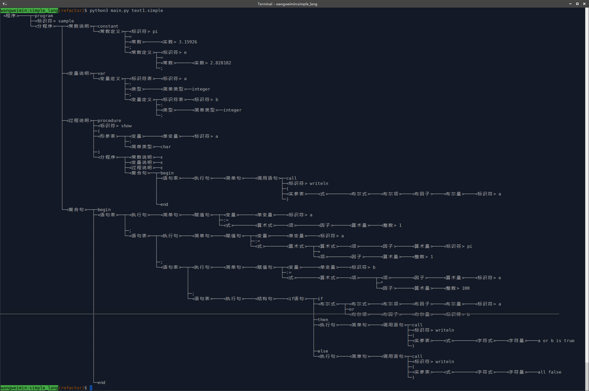
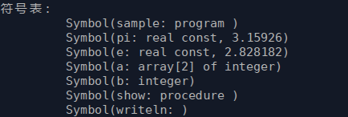
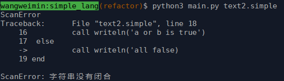
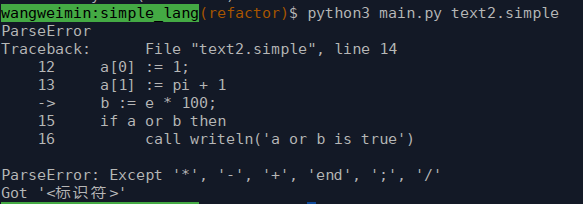
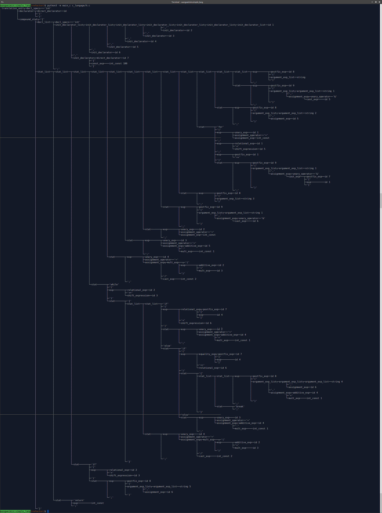

# C语言和Simple+语言(一个自定义的类Pascal语言)的语法分析器


## 功能
使用Python实现的C语言和Simple+语言的词法分析和语法分析器。

语法分析实现的功能有：
 - 利用文法推导式构造LR(1)分析表
 - 使用LR(1)分析表对输入的Token串进行语法分析，构建语法树
 - 在构建语法树的时候进行一些标识符类型的识别
 - 树形输出语法树，可视化输出语法树构建过程
 - 词法语法检错，显示出错代码上下文和出错原因

## 程序运行

```
python3 main.py src_path [show-tree-animation] [show-simplify-tree]
```
对输入路径为`src_path`的源文件进行语法分析，选项`show-tree-animation`用于开启可视化输出语法树构建过程，选项`show-simplify-tree`设置输出简化版的语法树

```
python3 main.py make-parse-table
```
构造语言的LR(1)语法分析表，并将分析表以文件的形式保存到项目目录的`data`文件夹中；

```
python3 main_c.py c_src_path
```
对C语言源程序进行语法分析并生成语法分析树，但程序词法分析所接受的Token为标准C语言的子集(比如不支持读入`5e-5`形式的浮点数)

下面为语法分析器对以下源程序进行语法分析的结果
```pascal
program sample
constant 
    pi=3.1415926;
    e=2.71828182;
var 
    a : array[2] of integer;
    b : integer;
procedure show(a:char) begin
	call writeln(a)
end
begin
    a[0] := 1;
    a[1] := pi + 1;
    b := e * 100;
    if a or b then
		call writeln('a or b is true')
	else
		call writeln('all false')
end
```
程序语法树构造结果：



加入`show-tree-animation`选项开启动画效果输出的程序运行过程:

[](https://asciinema.org/a/9PJfaMi7TqzxgjkGiI9opkldB)

经过符号类型识别后符号表的内容：



源文件存在词法错误时的输出：



源文件存在语法错误时的输出：



以下为程序对项目下二分搜索C程序`demo_src/binary_search.c`进行语法分析所得的语法树：



## TODO

 - 程序设计文档